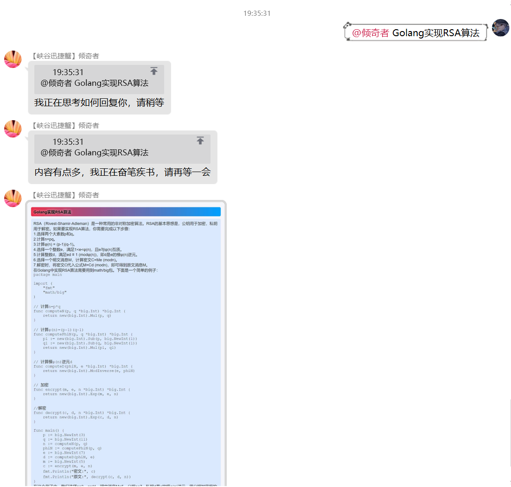

<div align=center> <h1>云崽QQ机器人的ChatGPT插件</h1> </div>
<div align=center>
   
   


</div>


### 推荐的相关文档和参考资料
本README
[文档1（建设中）](https://chatgpt-docs.err0r.top/) 
[插件常见问题（鹤望兰版）](https://www.wolai.com/4FCxxWAdjbrHF29MCJmAQK) 
[Yunzai常见问题（LUCK小运版）](https://www.wolai.com/oA43vuW71aBnv7UsEysn4T) 
[憨憨博客](https://blog.hanhanz.top/)

## 特点

* 支持单人连续对话Conversation，群聊中支持加入其他人的对话
* API模式下，使用 gpt-3.5-turbo API，ChatGPT官网同款模型，仅需OpenAI Api Key，开箱即用。**注意收费**
* 支持问答图片截图和聊天记录导出
* 支持AI性格调教，强烈推荐Bing自定义模式
* 支持对接vits回答直接转语音
* API3模式下，绕过Cloudflare防护直接访问ChatGPT的SSE API，与官方体验一致，且保留对话记录，在官网可查。免费。
* (已不再维护)提供基于浏览器的解决方案作为备选，API3不可用的情况下或担心账户安全的用户可以选择使用浏览器模式。
* 支持新[必应](https://www.bing.com/new)（token负载均衡，限流降级）
* 2023-03-15 API3支持GPT-4尝鲜，需要Plus用户
* 支持[ChatGLM](https://github.com/THUDM/ChatGLM-6B)模型。基于[自建API](https://github.com/ikechan8370/SimpleChatGLM6BAPI)

### 如果觉得这个插件有趣或者对你有帮助，请点一个star吧！

## 版本要求
Node.js >= 18 / Node.js >= 14(with node-fetch)
小白尽可能使用18版本以上的nodejs

## 安装与使用方法

### 安装

在安装之前，请先判断自己需要使用哪种模式，本插件支持官方API/第三方API/~~浏览器~~/必应四种模式。也可以选择**我全都要**(通过qq发送命令`#chatgpt切换浏览器/API/API3/Bing`实时切换)

> #### API模式和浏览器模式如何选择？
>
> * API模式会调用OpenAI官方提供的gpt-3.5-turbo API，ChatGPT官网同款模型，只需要提供API Key。一般情况下，该种方式响应速度更快，可配置项多，且不会像chatGPT官网一样总出现不可用的现象，但注意API调用是收费的，新用户有18美元试用金可用于支付，价格为`$0.0020/ 1K tokens`。（问题和回答**加起来**算token）
> * API3模式会调用第三方提供的官网反代API，他会帮你绕过CF防护，需要提供ChatGPT的Token。效果与官网和浏览器一致，但稳定性不一定。发送#chatgpt设置token来设置token。
> * (Deprecated)浏览器模式通过在本地启动Chrome等浏览器模拟用户访问ChatGPT网站，使得获得和官方以及API2模式一模一样的回复质量，同时保证安全性。缺点是本方法对环境要求较高，需要提供桌面环境和一个可用的代理（能够访问ChatGPT的IP地址），且响应速度不如API，而且高峰期容易无法使用。一般作为API3的下位替代。
> * 必应（Bing）将调用微软新必应接口进行对话。需要在必应网页能够正常使用新必应且设置有效的Bing登录Cookie方可使用。强烈推荐

1. 进入 Yunzai根目录

2. 请将 chatgpt-plugin 放置在 Yunzai-Bot 的 plugins 目录下

推荐使用 git 进行安装，以方便后续升级。在 Yunzai-Bot 根目录夹打开终端，运行下述指令进行安装

```shell
git clone --depth=1 https://github.com/ikechan8370/chatgpt-plugin.git ./plugins/chatgpt-plugin/
cd plugins/chatgpt-plugin
pnpm i
```

如果是手工下载的 zip 压缩包，请将解压后的 chatgpt-plugin 文件夹（请删除压缩自带的-master或版本号后缀）放置在 Yunzai-Bot 目录下的 plugins 文件夹内

> ~~浏览器模式仅为备选，如您需要使用浏览器模式，您还需要有**桌面环境**，优先级建议：API≈必应>API3>浏览器~~\
> ~~2.20更新：必应被大削，变得蠢了，建议还是API/API3优先~~\
> 4.2更新：必应站起来了，必应天下第一。建议都用必应，别用API/API3了。浏览器模式除非极其特殊的需求否则强烈建议不使用，已经不维护了。

3. 修改配置
**本插件配置项比较多，强烈建议使用[锅巴面板](https://github.com/guoba-yunzai/Guoba-Plugin)修改**

   复制`plugins/chatgpt-plugin/config/config.example.json`并将其改名为`config.json`\
   编辑`plugins/chatgpt-plugin/config/config.json`文件，修改必要配置项 \
   **请勿直接修改config.example.json**
   
4. 重启Yunzai-Bot
如通过锅巴面板升级可以热加载，无需重启。

---

### 相关配置

#### 配置文件相关

配置文件位置：`plugins/chatgpt-plugin/config/config.json`

部分关键配置项，其他请参照文件内注释：

|        名称         |        含义         |                        解释                         |
|:-----------------:| :-----------------: |:-------------------------------------------------:|
|       proxy       |      代理地址       |       请在此处配置你的代理，例如`http://127.0.0.1:7890`        |
|      apiKey       | openai账号的API Key | 获取地址：https://platform.openai.com/account/api-keys |

#### Token相关

与Token相关的设置需在qq与机器人对话设置，设置后方可使用对应的api

|        名称         |         含义         |                             解释                             |                           设置方式                           |
| :-----------------: | :------------------: | :----------------------------------------------------------: |:--------------------------------------------------------:|
| ChatGPT AccessToken | ChatGPT登录后的Token |                        具体解释见下方                        |                     \#chatgpt设置token                     |
|      必应token      |  必应登录后的Token   | 必应（Bing）将调用微软新必应接口进行对话。需要在必应网页能够正常使用新必应且设置有效的Bing 登录Cookie方可使用 | \#chatgpt设置必应token/\#chatgpt删除必应token/\#chatgpt查看必应token |


> #### 我没有注册openai账号？如何获取
>
> 您可以按照以下方法获取openai账号
>
> 进入https://chat.openai.com/ ，选择signup注册。目前openai不对包括俄罗斯、乌克兰、伊朗、中国等国家和地区提供服务，所以自行寻找办法使用**其他国家和地区**的ip登录。此外，注册可能需要验证所在国家和地区的手机号码，如果没有国外手机号可以试试解码网站，收费的推荐https://sms-activate.org/
>
> #### 我有openai账号了，如何获取API key和Access Token？
>
> - 获取API key
>   - 进入账户后台创建API key（Create new secret key）：https://platform.openai.com/account/api-keys
>
> - 获取Access Token
>   - **登录后**访问https://chat.openai.com/api/auth/session
>   - 您会获得类似如下一串json字符串`{"user":{"id":"AAA","name":"BBB","email":"CCC","image":"DDD","picture":"EEE","groups":[]},"expires":"FFF","accessToken":"XXX"}`
>   - 其中的XXX即为`ChatGPT AccessToken`
>
> #### ChatGPT AccessToken 设置了有什么用？我为什么用不了API模式
>
> - 部分API需要在和机器人的聊天里输入`#chatgpt设置token`才可以使用
>
> #### 我有新必应的测试资格了，如何获取必应Token？
>
> 1. JS一键获取
>
> 登录www.bing.com，刷新一下网页，按F12或直接打开开发者模式，点击Console/控制台，运行如下代码，执行后即在您的剪切板存储了必应Token
>
> ```js
> copy(document.cookie.split(";").find(cookie=>cookie.trim().startsWith("_U=")).split("=")[1]);
> ```
>
> 2. 手动获取
>
> 登录www.bing.com，刷新一下网页，按F12或直接打开开发者模式，点击Application/存储，点击左侧Storage下的Cookies，展开找到[https://www.bing.com](https://www.bing.com/) 项，在右侧列表Name项下找到"\_U"，_U的value即为必应Token
>
>
>
> 其他问题可以参考使用的api库 https://github.com/transitive-bullshit/chatgpt-api 以及 https://github.com/waylaidwanderer/node-chatgpt-api


### 使用方法

根据配置文件中的toggleMode决定联通方式。

- at模式：@机器人 发送聊内容即可

- prefix模式：【#chat+问题】，本模式可以避免指令冲突。

发挥你的想象力吧，~~调教~~拟造出你自己的机器人风格！


#### 文本/图片回复模式

>  #chatgpt文本/图片/语音模式

可以控制机器人回复的方式

#### 对话相关

> #chatgpt对话列表
>
> #结束对话 [@某人]
>
> #清空chat队列
>
> #移出chat队列首位
>
> #chatgpt开启/关闭问题确认
>
> ...

#### 设置相关

> #chat切换浏览器/API/API2/API3/Bing
>
> #chatgpt设置[必应]Token
>
> ...

#### 获取帮助

> #chatgpt帮助
>
> #chatgpt模式帮助

发送#chatgpt帮助，有更多选项可以配置

### 如何更新

发送#chatgpt更新指令。如果有冲突，可以使用#chatgpt强制更新。

## 示例与截图

- 程序员版



- 傲娇版


## TODO

* 预设分群组和个人

## 其他

### 常见问题

1. 如果在linux系统上发现图片模式下emoj无法正常显示，可以搜索安装支持emoj的字体，如Ubuntu可以使用`sudo apt install fonts-noto-color-emoji`

2. 我和机器人聊天但没有任何反应怎么办？

   可能是由于Yunzai-bot异常退出等原因造成Redis 队列中有残留的等待问题。使用`#清空队列`命令清除队列后再试。

3. Error [ERR_MODULE_NOT_FOUND]: Cannot find package 'xxx'.

   请参照本文档前面的安装依赖部分重新依赖。随着项目更新可能引入新的依赖。

   > 一般情况下请按照 [安装](#安装) 小节的内容重新安装依赖即可
   >
   >
   >
   > 最多的问题：载入插件错误：chat
   >
   > 问题详情：Error [ERR_MODULE_NOT_FOUND]: Cannot find package 'showdown' imported from /app/Yunzai-Bot/plugins/chatgpt-plugin/apps/chat.js
   >
   > 原因：没装依赖
   >
   > 解决方式：请参考文档在本插件目录下用`pnpm install`安装依赖，安装完就不报错了
   
4. 反代能自己搭吗？
   
   能。参考[这里](https://ikechan8370.com/archives/da-jian-chatgpt-guan-fang-fan-xiang-dai-li)

5. vit API能本地搭建吗？

   能。克隆下来安装依赖直接运行即可。
   
## 交流群

* QQ 559567232 [问题交流]
* QQ 126132049 [机器人试验场]

## 感谢

本项目使用或参考了以下开源项目
* https://github.com/transitive-bullshit/chatgpt-api
* https://github.com/waylaidwanderer/node-chatgpt-api
* https://github.com/acheong08/ChatGPT
* https://github.com/PawanOsman

本插件的辅助项目
* https://github.com/ikechan8370/node-chatgpt-proxy
* https://github.com/ikechan8370/SimpleChatGLM6BAPI

图片以及Bing模式支持 @HalcyonAlcedo
* https://github.com/HalcyonAlcedo/ChatGPT-Plugin-PageCache

语音vits模型来自于
* https://huggingface.co/spaces/sayashi/vits-uma-genshin-honkai

以及ChatGPT及OpenAI
* https://chat.openai.com/
* https://platform.openai.com/

ChatGLM
* https://huggingface.co/THUDM/chatglm-6b
* https://github.com/THUDM/ChatGLM-6B

## 赞助

如果觉得本项目好玩或者对你有帮助，愿意的话可以赞助我一口快乐水：

https://afdian.net/a/ikechan8370

## 贡献者

感谢以下贡献者

<a href="https://github.com/ikechan8370/chatgpt-plugin/graphs/contributors">
  
</a>


